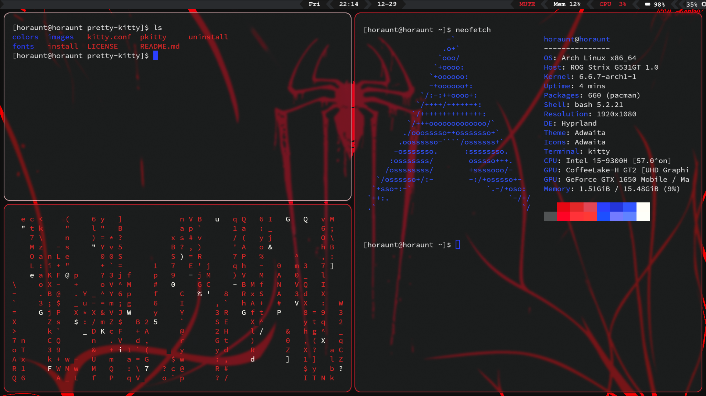

# Spider-Man Themed Arch Linux Rice

This is a Spider-Man themed Arch Linux rice with the following components:

- Desktop Environment: Hyprland
- File Manager: Thunar
- Wallpaper Service: Hyprpaper
- Application Manager: Rofi
- Status Bar: Waybar
- Terminal: Kitty

## Screenshot



## Installation

1. Install Arch Linux.
2. Clone this repository:

    ```bash
    git clone https://github.com/horaunt/dotfiles_spider.git
    ```

3. Install the required packages for each component:

   - Hyprland: [Installation instructions](https://wiki.hyprland.org/Getting-Started/Installation/)
   - Kitty: [Installation instructions](https://sw.kovidgoyal.net/kitty/#installation)
   - Rofi: [Installation instructions](https://github.com/davatorium/rofi#installation)
   - Thunar: [Installation instructions](https://docs.xfce.org/xfce/thunar/start)
   - Waybar: [Installation instructions](https://github.com/Alexays/Waybar#installation)
   - Hyprpaper: [Installation instructions](https://github.com/hyprwm/hyprpaper)

4. Configure each component according to your preferences.
5. Enjoy your Spider-Man themed Arch Linux rice!
